# 1. ¿Qué es GIT?
Git es un software de **control de versiones** de código abierto desarrollado por Linus Torvalds (el creador de Linux). Dicho software tiene como objetivo llevar un registro de los cambios en los archivos de un proyecto, además de coordinar el trabajo que varios usuarios puedan realizar sobre un mismo archivo en un repositorio de código.

# 2. ¿Qué es GITHUB?
Github es una plataforma de desarrollo colaborativo (a este tipo de plataformas también se le llaman **forjas**) que utiliza el sistema de control de versiones Git. Github nos permite almacenar repositorios de código en la nube y facilita compartir el repositorio con otros colaboradores. Además, versiones recientes han incorporado herramientas de gestión de proyectos.

Github ofrece varios tipos de suscripciones. Esta wiki se centra en la versión gratuita. También existen otras alternativas de código abierto como **GitLab** y **Codeberg**.

<div align="center">
  <a href="https://codeberg.org/">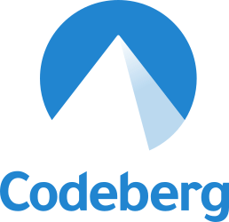</a>
  <a href="https://github.com/"></a>
  <a href="https://about.gitlab.com/"></a>
</div>

---

# 3. Funciones Básicas de GIT
Para Instalar Git podemos ir a su [documentación oficial](https://git-scm.com/install/) donde explican cómo instalarlo para diversos sistemas operativos.


## Creación y Clonación
* **Inicializar:** Crea una carpeta y ejecuta `git init`. Se creará una carpeta oculta `.git`.
* **Clonar:** Si quieres descargar un proyecto existente: `git clone URL_del_proyecto`.

## Configuración de usuario
Antes de continuar debemos configurar el nombre y correo electrónico. Para ello usaremos:

* `git config --global user.name "Tu Nombre"`
* `git config --global user.email "tu@email.com"`

`--global` indica que este nombre y correo deben usarse en todos los repositorios. Si solo quieres configurarlo para un proyecto específico, quita ese argumento.


## Debajo del capó: Las 3 Áreas
Git es un sistema **distribuido**. Cada contribuidor tiene una copia completa en su máquina. Localmente, Git se divide en 3 sub-partes:

1. **Working Directory:** Donde están tus archivos físicos (cambios no gestionados aún).
2. **Staging Area (Índice):** Donde Git vigila los cambios preparados. Se usa `git add`.
3. **Repository:** Tu copia local del historial. Se usa `git commit`.

> 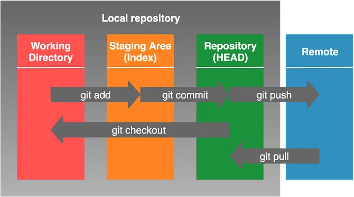

---

# 4. Gestión de Cambios

## Git Add e .gitignore
* `git add fileName`: Añade un archivo al índice.
* `git add .`: Añade todos los cambios de la carpeta actual.
* **.gitignore:** Archivo oculto en la raíz donde escribes qué archivos o extensiones Git **no debe rastrear** (ej: `node_modules/` o `.env`).

## Git Commit
Guarda los cambios del índice en el repositorio local:
`git commit -m "Mensaje descriptivo"`

* **Ver historial:** Usa `git log` para ver los commits realizados.
* **Diferencias:** `git diff commit1 commit2` para ver qué cambió entre dos estados. commit1 y commit2 son los hashes de los commits

## Revertir Cambios
1. `git checkout hash`: Mueve el puntero a ese commit (solo lectura/inspección).
2. `git reset --hard hash`: **Peligro.** Borra todo lo que esté por delante de ese commit.
3. `git revert hash`: Crea un nuevo commit que deshace los cambios del commit especificado. Es la opción más segura.

## Asignar un Commit
Si alguna vez entramos a trabjar en un proyecto y queremos ver quien ha hecho un commit, podemos usar el comando: `git blame <file>`, este comando permite ver que ha aportado cada usuario en cada archivo.


---
# 5 Git Branch: La Playa de Vías del Desarrollo

Las ramas (o *branches*) son el corazón del trabajo colaborativo. Imagina el desarrollo de un software como una **playa de vías de tren**:

* **La Vía Principal (`main` o `master`):** Es la vía por la que circula el tren de producción. Aquí solo debe haber código estable, limpio y listo para el usuario final.
* **Vías Secundarias (Ramas de función):** Cuando necesitas "reparar un vagón" (arreglar un bug) o "añadir un vagón de lujo" (nueva funcionalidad), sacas el tren de la vía principal a una vía secundaria. Allí puedes trabajar sin riesgo de chocar con otros trenes o detener el tráfico de la vía principal.


Esta estructura permite que diez desarrolladores trabajen en diez funciones distintas al mismo tiempo, cada uno en su propia "vía", para luego reincorporarse a la principal cuando todo esté verificado.

---

### Gestión de Ramas
Para moverte por estas vías, Git nos ofrece varios comandos:

* **Crear y cambiar en un paso:** `git checkout -b nombre-rama`. Es el más usado; crea la vía y te sitúa en ella al instante.
* **Listar vías:** `git branch`. Te muestra en qué rama estás (marcada con un asterisco) y qué otras existen localmente.
* **Saltar entre ramas:** `git checkout nombre-rama`. (Asegúrate de haber hecho `commit` de tus cambios antes de saltar, o Git podría impedírtelo para no perder datos).

---

### Unificando el ramas: Merge vs. Rebase
Una vez que el trabajo en la vía secundaria ha terminado, es hora de volver a la vía principal. Tenemos dos formas de hacerlo:

#### **Git Merge (La unión clásica)**
Crea un "commit de unión" que junta las dos historias.
* **Ventaja:** Conserva el historial exacto de cómo y cuándo se trabajó en la rama secundaria.
* **Uso:** `git checkout main` -> `git merge nombre-rama`.

#### **Git Rebase (La historia lineal)**
Mueve toda la rama secundaria y la coloca justo al final de la vía principal, como si siempre se hubiera trabajado allí.
* **Ventaja:** El historial queda limpio y lineal, sin commits de unión que "ensucien" el gráfico.
* **Uso:** `git checkout nombre-rama` -> `git rebase main`.


---

### Conflictos de Fusión
A veces, dos desarrolladores modifican la misma línea del mismo archivo en vías distintas. Cuando intentas unirlas, Git no sabe qué versión elegir y genera un **Conflicto**.

En ese momento, Git detiene la operación y marca el archivo:
```text
<<<<<<< HEAD
Código que ya estaba en la vía principal
=======
Código nuevo que traes de tu rama
>>>>>>> branch-name
```

¿Cómo se soluciona?

-  Abres el archivo y borras las marcas (<<<<, ====, >>>>).

-  Dejas el código como debería quedar finalmente.

-  Haces git add y git commit para confirmar que el conflicto está resuelto.

### Borrar Ramas

Una vez que una funcionalidad ya está en main, la vía secundaria ya no es necesaria y debe borrarse para no saturar el proyecto.

    Borrado seguro: git branch -d nombre-rama. Git solo te dejará borrarla si ya has fusionado los cambios con la vía principal.

    Borrado forzoso: git branch -D nombre-rama. Úsalo si quieres descartar un experimento que salió mal y no quieres conservar nada de ese código.

---
## [Git Remote Repository](https://git-scm.com/docs/git-remote/es)
Un repositorio remoto en Git es una versión del proyecto alojada en un servidor (como GitHub o GitLab). Es el "punto de encuentro" que permite la colaboración: tú trabajas en tu copia local y luego sincronizas tus avances con el servidor.

Los comandos esenciales para esta comunicación son: **remote**, **push**, **pull** y **fetch**.

---

### Configurar un Repositorio Remoto
Para conectar tu carpeta local con un servidor por primera vez:
```bash
git remote add origin <url-del-repositorio>

    origin: Es el nombre estándar (alias) que le damos al servidor remoto principal. Por convención se usa "origin", pero podrías tener varios (ej. uno para producción y otro para desarrollo).

    URL: La dirección HTTPS o SSH que te proporciona tu forja (GitHub/GitLab).
```
Para verificar tus remotos configurados usa: git remote -v.
Sincronización de Datos
###  Hacer un Push (Subir)

Envía tus commits locales al servidor para que el resto del equipo pueda verlos.
```

git push origin <nombre-de-la-rama>
```

La primera vez que subes una rama, usa git push -u origin <nombre-de-la-rama>. El parámetro -u (upstream) enlaza tu rama local con la del servidor. A partir de ahí, solo necesitarás escribir git push.

### Hacer un Fetch (Traer información)

Descarga la información del servidor pero no modifica tu código. Es como bajarse las noticias: ves lo que han hecho otros, pero no lo integras todavía en tus archivos.
```

git fetch origin
```

### Hacer un Pull (Traer y fusionar)

Descarga los cambios y los intenta mezclar automáticamente con tu trabajo actual. Es el equivalente a ejecutar un fetch seguido de un merge.
```

git pull origin <nombre-de-la-rama>
```

### Ramas Remotas (Remote-Tracking Branches)

Cuando trabajas con remotos, aparecen ramas con nombres como origin/main o origin/feature-x. Estas son ramas remotas.

Son "punteros" que actúan como una fotografía del último estado conocido del servidor. Tú no puedes escribir directamente en origin/main; solo puedes verla. Para trabajar en ella, debes crear una rama local que la "siga".

Comandos útiles para ramas remotas:

- Ver todas las ramas (locales y remotas): git branch -a.

- Borrar una rama en el servidor: git push origin --delete <nombre-de-la-rama>.

- Limpiar ramas fantasma: Si alguien borró una rama en GitHub, tu Git local puede seguir mostrándola. Borralas con:
git fetch --prune.

 

# 6. Git Avanzado

## Git Stash: El "Baúl" de Emergencias

Imagina que estás en medio de una funcionalidad compleja, con archivos a medio editar y código que aún no compila. De repente, surge un bug crítico en `main` que debes arreglar **inmediatamente**. 

No quieres hacer un `commit` de algo roto, pero Git no te deja cambiar de rama porque tienes "cambios sucios". Aquí entra `git stash`: permite guardar tus cambios actuales en una pila temporal, limpiar tu área de trabajo y recuperarlos más tarde.


---

### 1. Comandos Básicos

* **Guardar cambios:** Limpia tu directorio y guarda el estado actual.
 ```
  git stash
```

Guardar con nombre: (Recomendado) Para saber qué guardaste semanas después.
```
    git stash save "trabajo a medias en el motor de búsqueda"
```

Incluir archivos nuevos: Por defecto, stash no guarda archivos que acabas de crear (untracked). Usa el flag -u:
```
    git stash -u
```

###  Recuperar y Gestionar el Stash

Git guarda los stashes en una pila (el último en entrar es el primero en salir).

Ver la lista: Muestra todos tus stashes guardados.
```

git stash list
```
Verás algo como: stash@{0}: On feature-x: motor busqueda

Recuperar y borrar (Pop): Aplica el stash más reciente y lo elimina de la lista.
```

git stash pop
```

Recuperar sin borrar (Apply): Útil si quieres aplicar los mismos cambios en varias ramas.
```

git stash apply
```

Recuperar uno específico: Si tienes varios, usa su identificador.
```

git stash apply stash@{2}
```

###  Limpieza del Stash

Si ya no necesitas lo que guardaste, mantén tu baúl limpio:

- Borrar el más reciente: git stash drop

- Borrar uno específico: git stash drop stash@{1}

- Vaciar todo el baúl: git stash clear

### Escenario de uso real (Workflow)

- Estás en la rama desarrollo trabajando.

- Emerge una urgencia: git stash (tu rama queda limpia).

- Vas a otra rama: git checkout main -> arreglas el bug -> push.

- Vuelves a tu sitio: git checkout desarrollo.

- Recuperas tu trabajo: git stash pop.


## Git Hooks

Los Git Hooks son scripts que se ejecutan automáticamente en determinados momentos del ciclo de vida de un repositorio Git. Permiten a los desarrolladores personalizar el comportamiento de Git para adaptarlo a sus flujos de trabajo específicos. Por ejemplo prodriamos programar un Hook para que al hacer push al repositorio mande un email a todo el equipo para que actualize sus repositorios locales.

### Tipos de Hooks
Como se pueda apreciar en la imagen(en la imagen no aparecen todos), existen muchos tipos de hooks en funcion de cuando se ejecutan.


1. **applypatch-msg**: Ejecutado después de que se aplica un parche, pero antes de que se genere el mensaje de confirmación.
2. **commit-msg**: Ejecutado después de que se ingresó el mensaje de confirmación, pero antes de que se complete la confirmación.
3. **pre-commit**: Ejecutado despues de ejecutar `git commit` y  antes de que se cree el objeto commit. Es de los hooks más usados.
4. **prepare-commit-msg**: Ejecutado antes de que se abra el editor para ingresar el mensaje de confirmación. Permite modificar el mensaje predeterminado.
5. **post-commit**: Ejecutado después de que se ha realizado la confirmación. Útil para notificaciones o implmentaciones automáticas.
6. **pre-rebase**: Ejecutado antes de llevar a cabo una rebase. Permite ejecutar tareas antes de la rebase.
7. **pre-push**: Ejecutado antes de que se envíen cambios a un repositorio remoto. Ideal para ejecutar pruebas o chequeos de calidad.
8. **post-checkout**: Ejecutado después de cambiar de rama o hacer un nuevo checkout.
9. **post-merge**: Ejecutado después de completar un merge.
10. **pre-auto-gc**: Ejecutado antes de que Git realice una recolección de basura automática.
11. **pre-receive**: Ejecutado en el servidor antes de aceptar cambios en un repositorio.
12. **update**: Ejecutado en el servidor al recibir nuevos cambios, permite verificar que se pueden aplicar.
13. **post-receive**: Ejecutado en el servidor después de haber recibido y aceptado cambios.
14. **post-update**: Ejecutado después de recibir cambios, útil para actualizaciones de servicios o notificaciones.

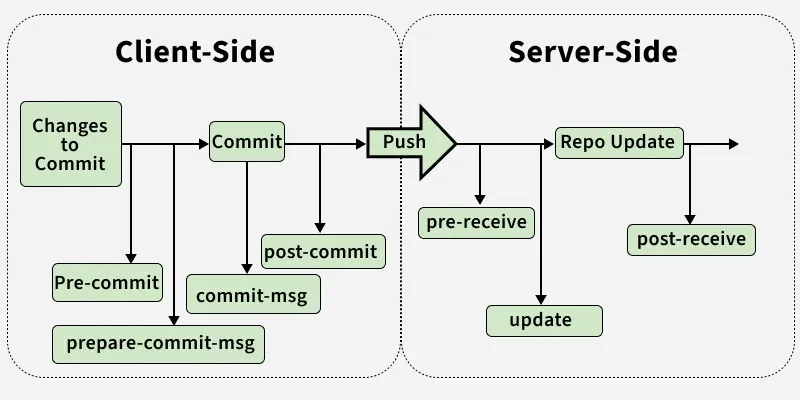

### Cómo Configurar un Hook

Para configurar un hook, primero debes navegar a la carpeta .git/hooks dentro de tu repositorio local. Allí encontrarás varios archivos de ejemplo con la extensión .sample. Para habilitar un hook, simplemente renombra el archivo removiendo la extensión .sample y hazlo ejecutable.

Aquí hay un ejemplo de un Hook que se va en el archivo .git/hooks/pre-commit y imprime un mensaje por pantalla para recordar al usuario que ponda un mensaje de commit útil:
```
bash
#!/bin/sh

echo "# Please include a useful commit message!" > $1
```


## Git Submodules: El Arte de la Modularización

Un submódulo es, esencialmente, un repositorio de Git incrustado dentro de otro repositorio de Git. Imaginemos que el proyecto es un coche: el motor, la radio y las ruedas podrían ser repositorios independientes que tú "ensamblas" en tu proyecto principal.
### ¿Por qué complicarse con Submódulos?

Tener un "monorepo" (todo en uno) es fácil al principio, pero los submódulos resuelven problemas de escala:

- Independencia de Versiones: El proyecto principal no guarda los archivos del submódulo, sino que guarda un puntero a un commit específico. Esto evita que una actualización en la librería rompa tu App hasta que tú decidas "subir de versión".

- Reutilización Real: Si mejoras una librería de utilidades en el Proyecto A, esa mejora está disponible para el Proyecto B, C y D automáticamente porque todos apuntan al mismo origen.

- Seguridad: Permite separar partes del código. Puedes dar acceso a externos al submódulo de la "UI" sin que vean el código sensible del "Core" en el repo principal.

### Flujo de Trabajo y Comandos
####  Añadir un Submódulo

Para incluir un repositorio externo en una carpeta específica de tu proyecto:
Bash

git submodule add https://github.com/usuario/libreria.git carpeta-destino

¿Qué sucede al ejecutar esto?

    Se crea el archivo .gitmodules: un archivo de texto que mapea la URL del proyecto con la carpeta local.

    Se añade la carpeta al área de preparación (staging).

    Ojo: Git no registra los archivos internos de la librería, solo registra el ID del commit actual de esa librería.

#### Clonar un Proyecto con Submódulos

Si clonas un repositorio que ya tiene submódulos, verás que las carpetas están vacías. Git no descarga los submódulos por defecto para ahorrar ancho de banda. Tienes dos opciones:

    Clonado "todo en uno":
    Bash

    git clone --recursive https://github.com/usuario/proyecto-principal.git

    Si ya clonaste y las carpetas están vacías:
    Bash

    git submodule update --init --recursive

#### Actualizar el Submódulo

Si el equipo de la librería ha subido mejoras y quieres traerlas a tu proyecto:
Bash

- Opción 1: Desde la raíz del proyecto principal
```
git submodule update --remote
```


- Opción 2: Entrando en la carpeta (como un git pull normal)
 ```
cd carpeta-submodulo
git pull origin main
```


### Detached HEAD

Cuando entras en la carpeta de un submódulo, Git te sitúa en un commit específico, no en una rama. Esto se llama Detached HEAD.

 IMPORTANTE: Si vas a modificar código dentro del submódulo, primero debes entrar en la carpeta y hacer un git checkout main (o la rama que uses). Si haces cambios en "Detached HEAD" y haces commit, esos cambios podrían perderse fácilmente.

### Eliminar un Submódulo 

Eliminar un submódulo es un proceso manual que requiere limpiar varios sitios:

- Eliminar la sección correspondiente en el archivo .gitmodules.

- Eliminar la sección en .git/config.

- Ejecutar: git rm --cached ruta/del/submodulo (sin la barra final).

- Borrar la carpeta físicamente y hacer commit.

### Ejemplo Práctico

Imagina que eres un desarrollador de juegos. Tienes un repo llamado MotorGrafico y otro llamado MiJuego.

- Escenario: Estás programando MiJuego y te das cuenta de que el MotorGrafico tiene un bug en las sombras.

- Acción: Como es un submódulo, entras en la carpeta del motor, arreglas el bug y haces push al repo del MotorGrafico.

- Resultado: Ahora, cualquier otro juego que estés desarrollando (Juego 2, Juego 3) que use ese mismo submódulo podrá beneficiarse del arreglo de las sombras con un simple update.


# 7.GitHub
## Crear Repositorio
Ya hemos explicado lo que es github y como crear un repositorio en git. Sin embargo tambien podemos crear el repositorio en github.

|Foto|Descripción|
|------|------------------|
|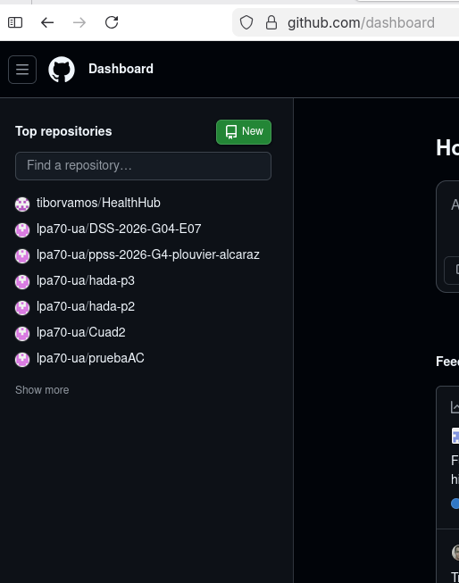|En la pantalla principal de github, podemos encontrar un boton con el texto New para crear un nuevo repositorio. |
|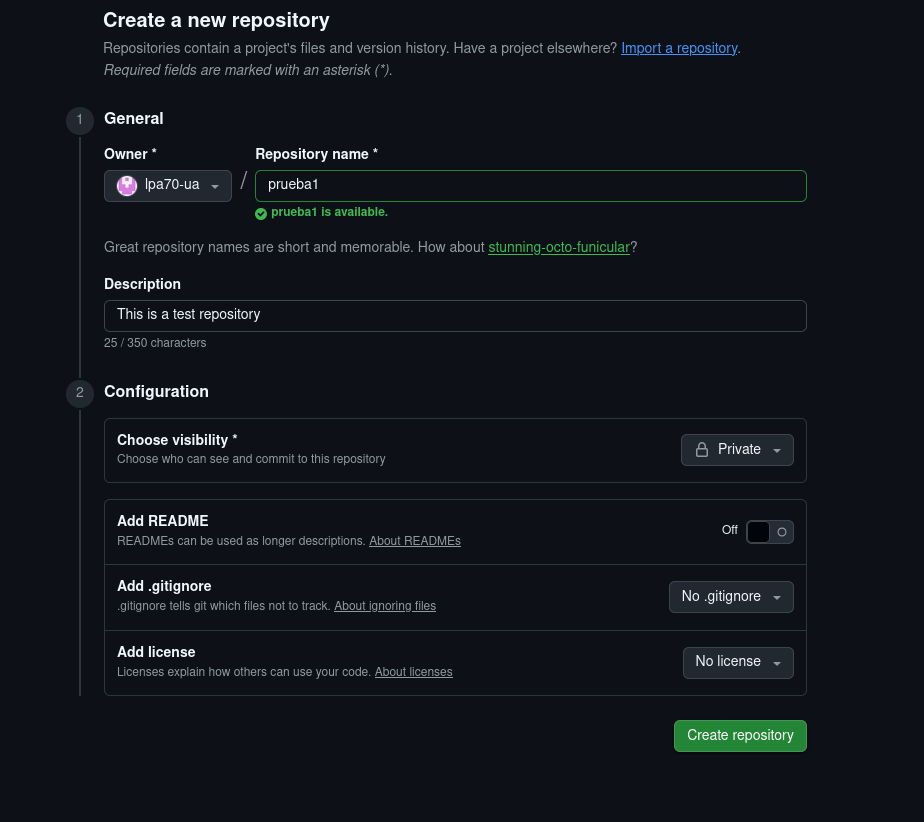| Una vez pulsado el boton, podemo rellenar los datos. Debemos elegir un nombre unico, la descripcion es opcional. Adicionalmente podemos añadir un readme, un .gitignore y una licencia. Estos tres ultimos parametros no importa si no los escogemos pues se pueden añadir mas tarde.|
|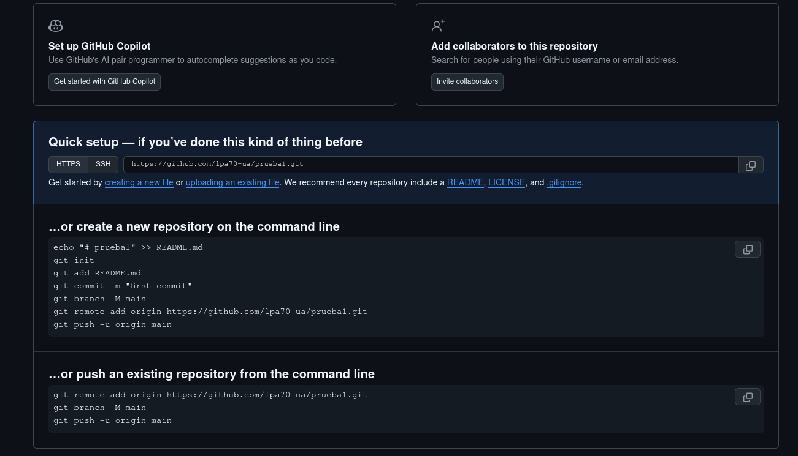| FInalmente en esta pantalla github nos deja muy bien explicado las maneras que tenemos de inicializar el repositorio en local, o bien subir in repositorio que tuviesemos en local. Tambien nos permite elegir en si queremos acceder a github a traves de HTTPS o de SSH. Nosotros usaremos HTTPS.|

## Añadir colaboradores
Si no hemos añadido los colaboradores al principio, lo podeos hacer depues desde los ajustes del proyecto.

|Foto|Descripción|
|------|------------------|
|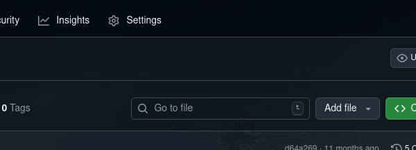|En la pantalla principal del repositorio escogemos la pestaña Settings|
|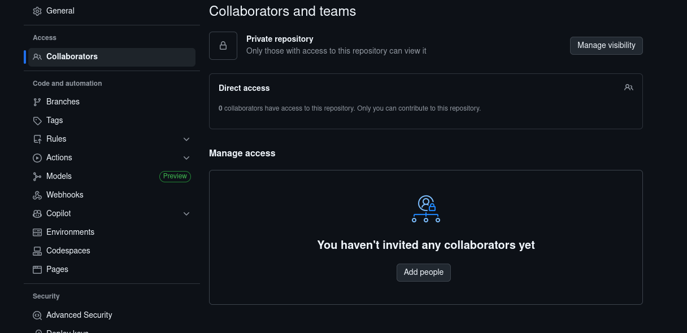|En la pestaña Settings vamos al submenú Collaborators donde ya prodremos añadir a nuestros colaboradores por su email o usuario de GitHub|

## Gestion De Acceso.

### Tipos de token

Desde hace tiempo que GitHub no usa contraseñas para autenticarse a la hora de interactuar con el repositiorio. Cuando hagamos git pull/push, git nos pedira un usuario y contraseña. El usuario es el de github pero la contraseña no es la de github si no que tenemos que crear un token para autorizar a git a operar en nuestro repositorio de github. Para emitir un token seguimos los siguientes pasos:

|Foto|Descripción|
|------|------------------|
|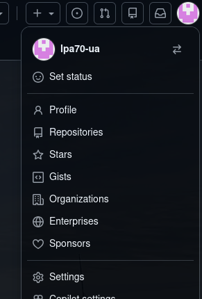|Pulsamos sobre el icono de nuestro perfil y vamos a Settings|
|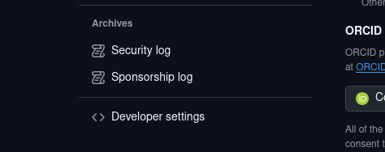|Dentro de ajustes nos delizamos hasta abajo del todo en la barra lateral  y pulsamos sobre Developper settings|
|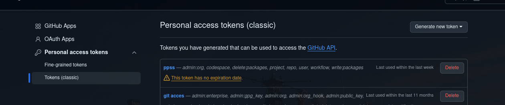|Dentro de Developer settings seleccionamos Tokens clasicos. Y despues generar nuevo token|
|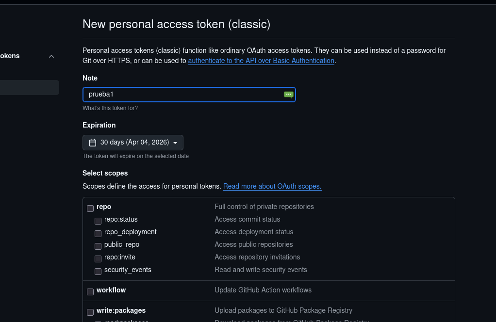|En esta pantalla ponemos un nombre al token, fecha de expiracion y los permisos que le otorgamos los privilegion que queramos.|

Una vez finalizado podemos crear token. A continuacion veras el token(es un codigo alfa-númerico muy largo), es importante que lo apuntes porque no podras volver a verlo.

Este token es el que pondremos en el campo de contraseña cuando git nos pregunte por ella. Pero escribir ese token tan largo cada vez que hacemos git pull/push es muy molesto e incomodo, por lo que git nos otorga ciertas herramientas para gestionar el tokén.


### Gestión de Tokén
El Credential Helper de Git permite almacenar de manera segura tus credenciales (como tokens de acceso) para que no tengas que ingresarlas cada vez que interactúas con un repositorio remoto. Esto simplifica el flujo de trabajo y mejora la eficiencia al trabajar con Git.
Configuración del Credential Helper

Para configurar un Credential Helper, puedes usar el siguiente comando: `git config --global credential.helper cache`

Este comando almacenará tus credenciales en memoria durante un período de tiempo determinado (15 minutos por defecto). Si deseas cambiar el tiempo, puedes especificar el siguiente argumento: `git config --global credential.helper 'cache --timeout=3600'`.

Donde el valor de 3600 es el tiempo en segundos que deseas mantener las credenciales en la memoria.
Almacenamiento Persistente

Si prefieres almacenar tus credenciales de manera más permanente, puedes usar: `git config --global credential.helper store`

Esto guardará tus credenciales en un archivo de texto plano en tu directorio de usuario. Sin embargo, esto puede plantear riesgos de seguridad.
Cuidado con el Almacenamiento de Tokens

Al guardar tus credenciales, ten en cuenta que debemos :
- Evitar el almacenamiento en texto plano: Si es posible, utiliza el método de cache o una herramienta de gestión de gestion de contraseñas.
- Revisa los permisos: Asegúrate de que el archivo donde se almacenan las credenciales no sea accesible por otros usuarios.
 - Revoca tokens: Si sospechas que tu token ha sido comprometido, eliminalo inmediatamente  y genera uno nuevo.

 Para revisar tu configuración actual de Credential Helper, utiliza: `git config --global --get credential.helper`

## kanbans

Los Kanbans en GitHub son herramientas de gestión de proyectos que permiten organizar y visualizar el trabajo de forma visual. Se basan en la metodología Kanban, un sistema de gestión del flujo de trabajo originario de la manufactura japonesa. 
En los Kanbans podemos crear tareas y asignarles un estado, por ejemplo los estados mas comunes son(To-do, in progress y Done).

### Como crear un Kanban
Para crear un Kanban:

1. Primero debemos estar en nuestro repositorio, y en el menu horizontal superior seleccionamos Projects
2. Dentro de projects seleccionamos el botón verde de crear nuevo proyecto.
3. Ahora GitHub nos permite seleccionar distintos tipos de proyectos y nosotros seleccionamos Kanban.
4. En la nueva Pestaña podemos selccionar que elementos del repositorio queremos importar al proyecto. Podemos seleccionar open issues/open pull request y ambos. Seleccionamos la que mas nos guste. Ademas tambien podemos cambiar el repositorio asociado al proyecto si así lo deseamos.
5. Una vez el proyecto se haya creado, veremos lo siguente:


### Modificar el Kanban
Si por la razon que fuera, necesitamos modificar el kanban(borrar columnas y cambiar el nombre de las columnas ...) se puede realizar pulsando los puntos suspensivos de cada columna.

### Añadir elementos
1. Para añadir un nuevo elemento a una columan, tan solo debemos pasar el raton por encima y pulsar donde pone add item. 
2. Posterioment aparecera una barra de texto inferior donde pondremos el titulo del elemento y pulsamos enter.
3. Nos preguntara el repositorio que queremos usar y pulsamos en blank issue
4. En esta pestaña podremos modificar escribir una descripcion, asignar colaboradores al issue , añadir una etiqueta...
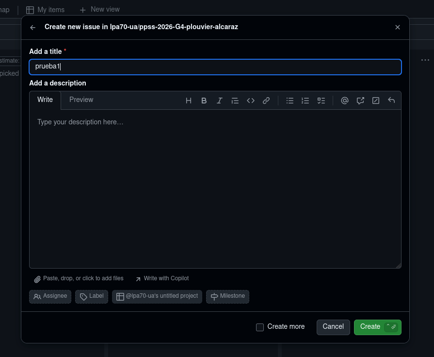

### Añadir Colaboradores
Es importante mencionar que los repositorios de github y el proyecto kanban no estan del todo relacionados, por lo que los colaboradores de un repositorio no pueden acceder de serie al kanban. Para añadirlos se hace desde los ajustes del proyecto kanban que se encuentran en los puntos suspensivos arriba a la derecha.
<div align="center">

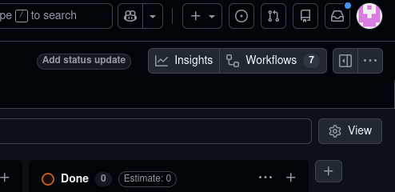
</div>


## Pull Request
Supongamos que estamos trabajando en una empresa donde usan la siguiente estructura de ramas:

- Rama `main` -> version estable del programa.
- Rama `development` -> version mas reciente en desarrollo.
- Rama `featureX`-> ramas que se crean en para desarrollar cada caracteristica del codigo.
- 
Hasta ahora lo que haríamos es crear una rama feature, desarrollar nuestra característica y luego unificarla con develop. Los equipos profesionales no funcionan así. En estos equipos, no se puede realizar un cambio al código común sin que alguien más valide tu código.

Para esto GitHub facilita los Pull Request (PR). Una PR no es un comando de Git, es una funcionalidad de la plataforma (GitHub, GitLab, Bitbucket) que actúa como una "petición formal" para fusionar tu trabajo en una rama común. 

--
### Pasos para realizar una Pull Request (Workflow)

El flujo de trabajo estándar en GitHub tras terminar el desarrollo en tu rama local es el siguiente:
#### Paso 1: Subir la rama a GitHub

Una vez que has terminado tus cambios y has hecho los commits correspondientes en tu rama feature, debes subirla al repositorio remoto:
```
git push origin featureX
```

#### Paso 2: Iniciar la petición en la web

Al entrar en el repositorio en GitHub, la plataforma detectará que acabas de subir una rama nueva y te mostrará un aviso destacado. Es el momento de iniciar la PR.
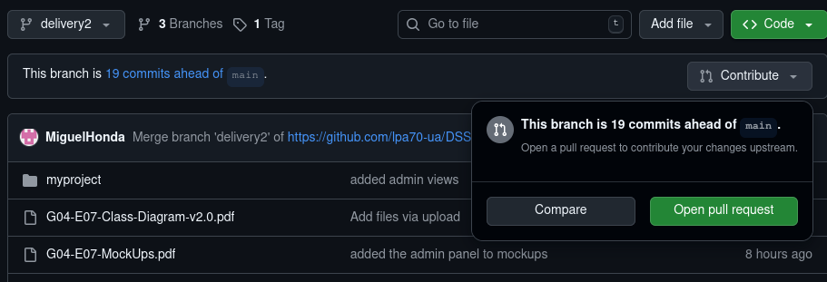
GitHub detecta los cambios en tu rama feature (en la imagen delivery2) y te muestra el botón verde "Compare & pull request". También puedes pulsar en la pestaña "Contribute" para abrir el mismo menú.

#### Paso 3: Rellenar los datos y crear

Al pulsar el botón, irás a una pantalla de configuración. 
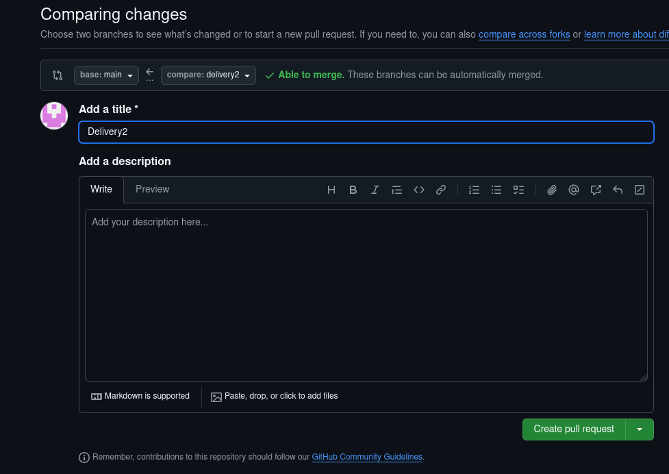

En esta pantalla prodemos:

- Determinar la rama base(a la que vamos a unificar los cambios) y la rama con los cambios. Es posible que si hay conflictos entre las ramas no nos deje unificar las ramas y nos muestre un mensaje de error.
- Añadir un titulo y una descripcion de los cambios que hemos realizado.
- Asignar usuarios para revisar el pull request.
- Crear el pull request.

#### La Revisión de Código

Una vez creada la PR, tu trabajo se somete a revisión. Es el momento en el que el equipo entra en acción:

1. Validación Automática (GitHub Actions): Si hay tests configurados, se ejecutarán automáticamente. Si fallan, aparecerá un aspa roja y no se debería fusionar el código hasta arreglarlo.

2. Revisión Humana (Code Review): Tus compañeros revisarán los cambios en la pestaña "Files changed". Pueden dejar comentarios en líneas específicas, pedir correcciones (Request changes) o aprobar el trabajo (Approve).

3. El Merge: Solo cuando el código tiene las aprobaciones necesarias y pasa los tests automáticos, se habilita el botón verde de "Merge pull request" para fusionar el código definitivamente en la rama base.

|Estado|Significado|
|----------|-----------------|
|Open|La PR está activa y esperando revisión.|
|Draft|Trabajo en progreso. Se puede ver pero no fusionar.|
|Merged|El código ha sido fusionado en la rama principal.|
|Closed|La PR ha sido descartada sin fusionar.|


## Github Actions

GitHub Actions es una plataforma de Integración Continua y Despliegue Continuo (CI/CD) que permite automatizar todos tus flujos de trabajo de desarrollo directamente desde GitHub.
¿Para qué sirve?

Si los Git Hooks se ejecutan en tu ordenador (local), las Actions se ejecutan en los servidores de GitHub (remoto). Sirven para que, cada vez que alguien suba código o abra una Pull Request, ocurran cosas automáticamente:

- Compilar el código: Comprobar que no hay errores de sintaxis.

- Pasar Tests: Ejecutar Maven o JUnit para asegurar que nada se ha roto.

- Revisar el estilo: Pasar un Linter para que todo el equipo escriba el código igual.

- Desplegar: Subir la web o la App a un servidor automáticamente si todo lo anterior es correcto.

### ¿Cómo se configuran?

GitHub utiliza archivos de configuración en formato YAML (con extensión .yml). Estos archivos deben guardarse obligatoriamente en una ruta específica de tu proyecto: .github/workflows/.
Conceptos clave de un Workflow:

- Workflow: El proceso automatizado total (un archivo .yml).

- Events: El disparador. Ej: on: [push] (cuando alguien sube algo).

- Jobs: Un grupo de pasos que se ejecutan en una misma máquina virtual (Runner).

- Steps: Las tareas individuales (instalar Java, correr comandos, etc.).

- Ejemplo Práctico: El "Inspector de Maven"

Supongamos que queremos que GitHub revise tu proyecto de Java cada vez que alguien haga un push a la rama main. Crearías el archivo .github/workflows/maven-check.yml:

```
name: Java CI con Maven

#  ¿Cuándo se activa?
on:
  push:
    branches: [ "main" ]
  pull_request:
    branches: [ "main" ]

# ¿Qué va a hacer?
jobs:
  build:
    runs-on: ubuntu-latest  # GitHub nos presta una máquina Linux gratis

    steps:
    - name: Copiar código en la máquina virtual
      uses: actions/checkout@v4

    - name: Configurar Java 17
      uses: actions/setup-java@v4
      with:
        java-version: '17'
        distribution: 'temurin'

    - name: Ejecutar los Tests de Maven
      run: mvn test 
```

### Diferencias con Git Hooks (Server-Side)

Aunque existen los hooks de servidor de Git (como pre-receive), en GitHub usamos Actions porque:

- Aislamiento: Cada Action corre en una máquina virtual limpia (contenedor), sin ensuciar el servidor de Git.

- Visibilidad: Si una Action falla, verás una X roja en tu commit o Pull Request. Si pasa, verás un check verde.

- Facilidad: No necesitas tocar la configuración interna del servidor; solo creas un archivo de texto en tu repo.